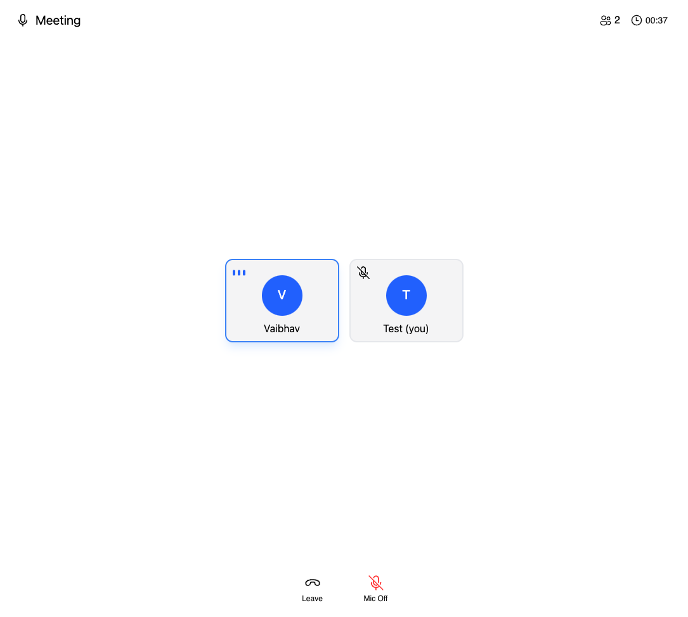

# Audio Room Example

This example showcases how you can create an audio room with RealtimeKit's UI Kit.

## Prerequisites

To use this example, please create an `Audio (WebRTC)` meeting type preset in the [RealtimeKit Dashboard](https://dash.cloudflare.com/?to=/:account/realtime/kit) and kindly ensure that Audio permissions are enabled in the preset.

## Limitations

This example is a basic implementation of an audio room and doesn't cover all the features of RealtimeKit, such as Webinar, Screen Sharing, Device Switching, etc. It is recommended to use this sample as a starting point for your own implementation.

## Screenshots

## See source

[See source](./src/App.tsx)
