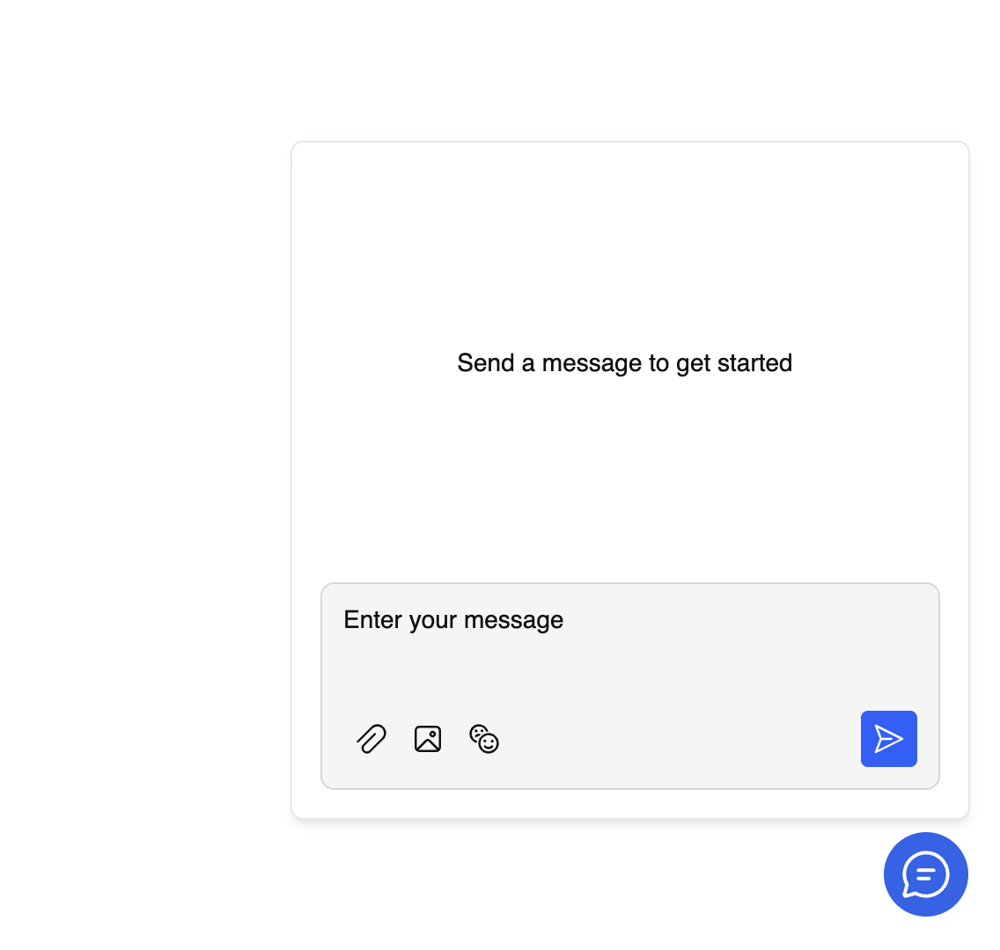

# RealtimeKit Chat Widget demo

This example showcases how you can build a Chat widget using RealtimeKit Chat SDK

---

[See source](./src/components/App.tsx)

## Prerequisites

1. Make sure to have a preset named `chat`, that has Chat permissions enabled.

## Getting started

1. Generate a participant token on your server.
2. `npm install`
3. `npm run dev`
4. Open the example with `?authToken=<participant-token>`.

Do not put RealtimeKit API credentials in this example. API keys and org IDs must stay on your server.
